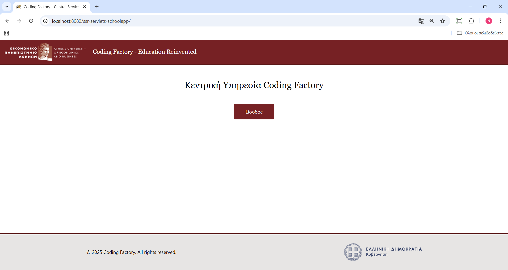

# 🏫 **School Management App**

## 📋 Description

The **School Management App** is a web-based application designed to manage core school resources.  
This version currently focuses on **Teacher and Student Management**.

The project is built with:

- **Server-Side Rendering (SSR)**
- **Session-Based Authentication**
- **Clean Architecture & Service-Oriented Design**
- **Model-View-Controller (MVC)** architecture

**Controllers** are implemented using **Jakarta Servlets**, and views are rendered with **Java Server Pages (JSP)**.  
For styling, it utilizes **Tailwind CSS**, following a **responsive mobile-first design**.

---
## 🔐 Authorization & Roles

The **School Management App** implements a role-based authorization system with two distinct user roles:

### 1. **Admin Role**
- **Permissions**:
    - Full access to all resources and functionalities in the application.
    - Can **Add**, **Update**, **Delete**, and **View** records for both **Teachers** and **Students**.

  **Use Cases**:
    - **Managing Teachers**: Admin can add new teachers, update their details, and remove teachers from the system.
    - **Managing Students**: Admin can add new students, edit their details, and delete students from the system.
    - **Viewing Reports**: Admin has unrestricted access to view any data related to teachers and students.

### 2. **Light_Admin Role**
- **Permissions**:
    - Restricted to **View Only** permissions for both **Teachers** and **Students**.
    - Cannot **Add**, **Update**, or **Delete** records; only the view action is allowed for both entities.

  **Use Cases**:
    - **Viewing Teacher Data**: Light Admin can view the list of all teachers, their details, and courses.
    - **Viewing Student Data**: Light Admin can view the list of all students, their details, and assignments.

---

### **Authentication Flow**
1. **Login Process**:
    - Users are prompted to log in via the **Session-based Login System**.
    - The login process validates user credentials and checks the associated role.
    - Depending on the role, the user is granted access to appropriate pages and features within the application.

2. **Role-Based Access Control**:
    - After successful login, users are directed to a dashboard.
    - **Admins** have full access to all resources, while **Light Admins** are limited to viewing functionality only.

3. **Session Management**:
    - Sessions are stored on the server, ensuring that access is granted or restricted based on user role throughout the session lifecycle.

---

### **Security & Data Protection**
- **Password Hashing**: All passwords are securely hashed using `BCrypt` to protect sensitive data.
- **Access Control**: Role-based access ensures that only authorized users can perform specific actions in the system.

---

## ✅ Features

- ✔️ **Manage Teachers** – Add, update, delete teacher records
- ✔️ **Manage Students** – Full CRUD operations on student data
- ✔️ **Session-based Login System**
- ✔️ **Separation of Concerns** using SOA and MVC
- ✔️ **Reusable Services and DAOs**
- ✔️ **Mobile-Responsive UI** powered by Tailwind CSS
- ✔️ **Secure Password Hashing** using `BCrypt`

---

## 🛠 Tech Stack

| Layer            | Technology                           |
| ---------------- | ------------------------------------ |
| Language         | Java 17                              |
| Web Framework    | Jakarta EE (Servlets, JSP, EL, JSTL) |
| Frontend Styling | Tailwind CSS                         |
| Build Tool       | Maven                                |
| Database         | MySQL                                |
| Connection Pool  | Apache Commons DBCP2                 |
| Authentication   | BCrypt                               |
| App Server       | Apache Tomcat                        |

---

## 📁 Project Structure

- `src/`
    - `main/`
        - `java/`
            - `authentication/`        # Authentication related classes
            - `controller/`            # MVC controllers
            - `core/`                  # Core application components
            - `dao/`                   # Data Access Objects (database layer)
            - `dto/`                   # Data Transfer Objects
            - `exceptions/`            # Custom exception classes
            - `filter/`                # Servlet filters
            - `mapper/`                # Object mapping/transformation
            - `model/`                 # Domain models/entities
            - `security/`              # Security configuration
            - `service/`               # Business logic services
            - `util/`                  # Utility/helper classes
            - `validator/`             # Validation logic
        - `webapp/`
            - `img/`                   # Image assets
            - `js/`                    # JavaScript files
            - `WEB-INF/`               # Protected resources
                - `jsp/                   # JSP view files
                - `web.xml                # Deployment descriptor
            - `index.jsp`              # Application entry point
- `pom.xml`                        # Maven build file
- `README.md`                      # Project documentation

## **Installation & Deployment**

### **Prerequisites**

- **Java 17+** (Ensure Java is installed: `java -version`)
- **Apache Maven** (Verify installation: `mvn -version`)
- **MySQL Database** (Required for data storage)
- **Apache Tomcat 10.1**

### **Setup Instructions**

1. **Clone the Repository**

   ```bash
   git clone git@github.com:nickTheof/school-app-servlets-jsp.git
   cd school-app-servlets-jsp

   ```

2. **Database setup**

    1. **Create a MySQL User**  
       In order to connect to the MySQL database, you must create a new user with the following credentials:

        - **Username**: `user7`
        - **Password**: (Choose a secure password for the user)

    2. **Step 2: Set the User Password in the Environment Variable**

        - **Environment Variable Name**: `PASSWD_USER7`
        - **Environment Variable Value**: The password you used when creating the `user7` MySQL user.

    3. **Step 3: Database Schema and Data**
        - You should create a database schema with name school7dbstaging
        - You can import db schema and data from the dump file you can will in the src/main/resources/sql

3. **Build the Application**

   ```bash
   mvn clean package

   ```

4. **Deploy to Tomcat**
   Copy the generated .war from target/ to Tomcat's webapps/ folder:

   ```bash
   cp target/ssr-servlets-schoolapp.war /path/to/tomcat/webapps/
   ```

   Start Tomcat and access:

   ```bash
   http://localhost:8080/ssr-servlets-schoolapp/
   ```

## 📸 **Screenshots**



